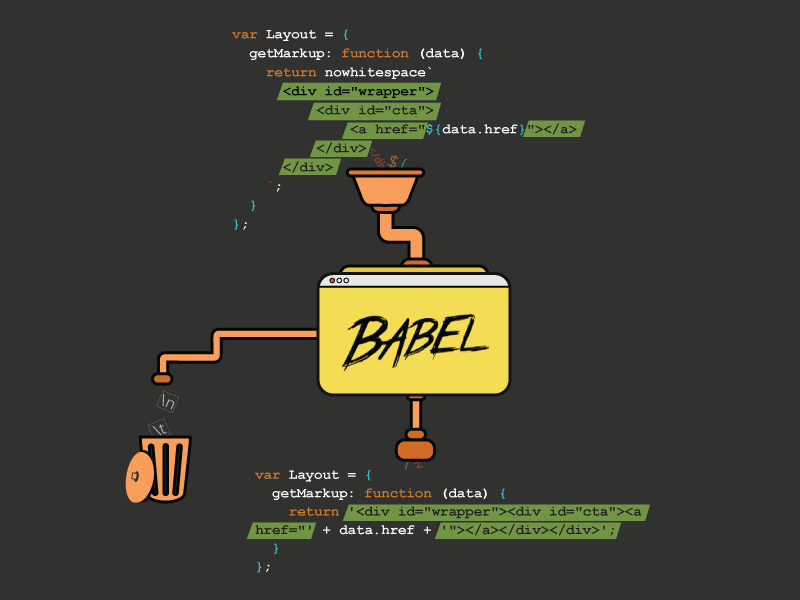
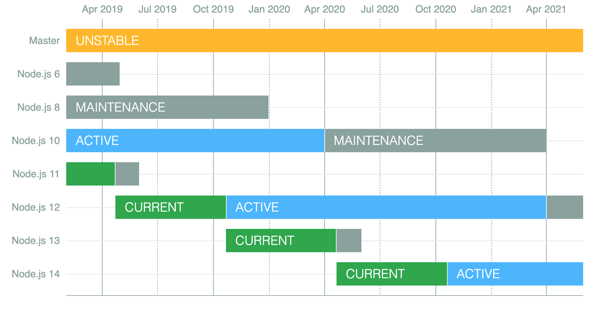
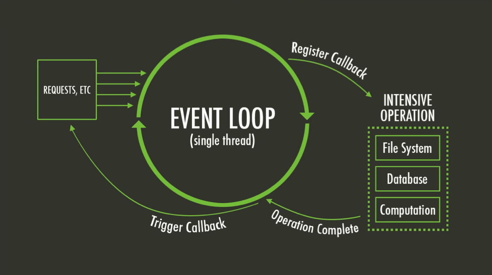
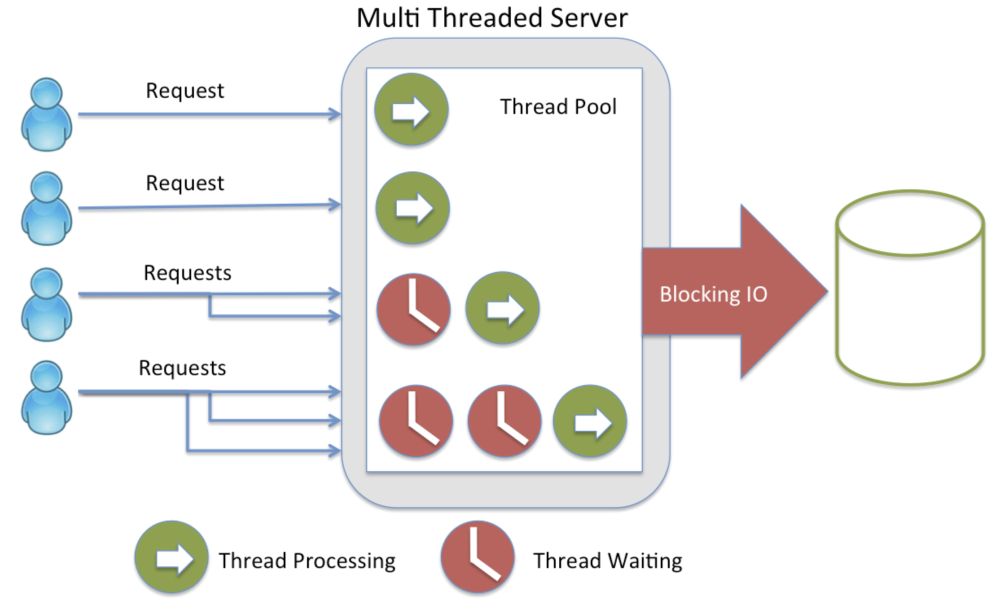

# Clase 1: Node.js


## JavaScript


> JavaScript (abreviado comúnmente JS) es un lenguaje de programación interpretado, dialecto del estándar [ECMAScript](https://es.wikipedia.org/wiki/ECMAScript). Se define como orientado a objetos, basado en prototipos, imperativo, débilmente tipado y dinámico.

> Se utiliza principalmente en su forma del lado del cliente (client-side), implementado como parte de un navegador web permitiendo mejoras en la interfaz de usuario y páginas web dinámicas aunque existe una forma de JavaScript del lado del servidor (Server-side JavaScript o SSJS). Su uso en aplicaciones externas a la web, por ejemplo en documentos PDF, aplicaciones de escritorio (mayoritariamente widgets) es también significativo. [JavaScript Wikiwand](https://www.wikiwand.com/es/JavaScript)


### Características

- Multiparadigma
- Imperativo y estructurado
- Dinámico
	- Tipado dinámico
	- Objetual
	- Evaluación en tiempo de ejecución
- Funcional
	- Funciones de primera clase
- Prototípico
	- Prototipos
	- Funciones constructoras
- Entorno de ejecución
- Funciones como métodos
- Arrays y la definición literal de objetos
- Expresiones regulares

### [ECMA-262](https://www.wikiwand.com/es/ECMAScript)

- [Tabla de compatibilidad de Node.js](http://node.green/)
- [Compatibilidad de ECMA10](https://2ality.com/2019/04/nodejs-esm-impl.html)
- Versiones:
    - Versión 1 (Junio de 1997)
    - Versión 2 (Junio de 1998)
    - Versión 3 (Diciembre de 1999)
    - Versión 3 (Abandonado)
    - Versión 5 (Diciembre de 2009)
    - Versión 5.1 (Diciembre de 2011)
    - Versión 6 (Junio de 2015) ([funcionalidades](http://es6-features.org/#ArrayMatching))
    - Versión 7 (Junio 2016) ([funcionalidades](https://node.university/blog/498412/es7-es8))
    - Versión 8 (Junio 2017) ([funcionalidades](https://node.university/blog/498412/es7-es8))
    - Versión 9 (2018) ([funcionalidades](https://medium.freecodecamp.org/es9-javascripts-state-of-art-in-2018-9a350643f29c))
    - Versión 10 (2019) ([funcionalidades](https://medium.com/@selvaganesh93/javascript-whats-new-in-ecmascript-2019-es2019-es10-35210c6e7f4b))

### ¿Necesito un [Polyfill](https://www.wikiwand.com/en/Polyfill)?

**Compiladores**


- [Coffeescript](http://coffeescript.org/)
- [Typescript](http://www.typescriptlang.org/)
- [NativeScript](https://www.nativescript.org/)
- [Livescript](http://livescript.net/)

**Transpiladores**



- [Babel](https://babeljs.io/)
- [Traceur](https://github.com/google/traceur-compiler)

## Node.js


> Node.js es un entorno en tiempo de ejecución multiplataforma, de código abierto, para la capa del servidor (pero no limitándose a ello) basado en el lenguaje de programación ECMAScript, asíncrono, con I/O de datos en una arquitectura orientada a eventos y basado en el motor V8 de Google. Fue creado con el enfoque de ser útil en la creación de programas de red altamente escalables, como por ejemplo, servidores web. Fue creado por Ryan Dahl en 2009 y su evolución está apadrinada por la empresa Joyent, que además tiene contratado a Dahl en plantilla - [Wikipedia](https://www.wikiwand.com/es/Node.js)

**Un poco diferente a un servidor tradicional**


### Puntos Fuertes

- Asincronía (no bloqueo)
- Backend completo
- Gestión de paquetes a través de `npm` (comunidad)
- Single thread (paralelismo)
- Librerías propias
- Utilidades
- Código abierto
- Basado en el V8 (escrito en C++) de Google
- Multiplataforma
- Orientado a Eventos
- **No se limita solo a servidores HTTP**

### ¿Es oro todo lo que reluce?

**Dependencias, dependencias, dependencias... y más dependencias**


- [How one developer just broke Node, Babel and thousands of projects in 11 lines of JavaScript](http://www.theregister.co.uk/2016/03/23/npm_left_pad_chaos/)
- [A discussion about the breaking of the Internet](https://medium.com/@mproberts/a-discussion-about-the-breaking-of-the-internet-3d4d2a83aa4d#.r9oqkkuhb)
- [One developer just broke Node, Babel and thousands of projects in 11 lines of JavaScript](https://laravel-news.com/2016/03/one-developer-just-broke-node-babel-thousands-projects-11-lines-javascript/)
- [El programador que borró 11 líneas de código y se cargó Internet](http://www.omicrono.com/2016/04/desaparicion-en-node-js-de-left-pad/)

### Librerías interesantes

- [Grunt](http://gruntjs.com/)
- [Gulp](http://gulpjs.com/)
- [Express](http://expressjs.com/es/)
- [Mongoose](http://mongoosejs.com/)
- [Socket.io](http://socket.io/)
- [Apache Cordova](http://cordova.apache.org/)
- [Async](https://www.npmjs.com/package/async)
- [Chalk](https://www.npmjs.com/package/chalk)
- [J5](http://johnny-five.io/)
- [GraphicsMagick](http://aheckmann.github.io/gm/)
- [Marked](https://github.com/chjj/marked)
- [Node-restify](https://github.com/restify/node-restify)
- [Webpack](https://github.com/webpack/webpack)
- [Morgan](https://github.com/expressjs/morgan)
- [Nodemailer](https://github.com/nodemailer/nodemailer)
- [Passportjs](http://passportjs.org/)
- [Cheerio](https://github.com/cheeriojs/cheerio)
- [X-ray](https://github.com/lapwinglabs/x-ray)
- [Bower](https://bower.io/)
- [PM2](http://pm2.keymetrics.io/)
- [Electron](http://electron.atom.io/)
- [Yeoman](http://yeoman.io/)
- [Babel](https://babeljs.io/)
- [Helmet](https://www.npmjs.com/package/helmet)
- [Faker](https://www.npmjs.com/package/faker)
- [Protractor](https://www.npmjs.com/package/protractor)
- [Nightwatch.js](http://nightwatchjs.org/)
- [Cypress.io](https://www.cypress.io/)
- [Hubot](https://hubot.github.com/)
- [Botkit](https://www.botkit.ai/)

## El ecosistema de Node.js


### Un poco de repaso...

#### APIs

> Una API representa la capacidad de comunicación entre componentes de software.

**CRUD**


- **Create** (POST):
    - Respuesta 200 - OK
    - Respuesta 204 - Sin contenido
    - Respuesta 404 - No encontrado
    - Respuesta 409 - Conflicto, ya existe
- **Read** (GET):
    - Respuesta 200 - OK
    - Respuesta 404 - No encontrado
- **Update** (PUT):
    - Respuesta 200 - OK
    - Respuesta 204 - Sin contenido
    - Respuesta 404 - No encontrado
- **Delete** (DELETE):
    - Respuesta 200 - OK
    - Respuesta 404 - No encontrado

**Códigos de respuesta HTTP**:

- 1xx Informativas
- 2xx Peticiones Correctas
- 3xx Redirecciones
- 4xx Errores Cliente
- 5xx Errores Servidor


[Lista de respuestas HTTP](https://es.wikipedia.org/wiki/Anexo:C%C3%B3digos_de_estado_HTTP)

[Especificación](https://tools.ietf.org/html/rfc2616#section-10)

**Ejemplos**:
- [Rick & Morty API](https://rickandmortyapi.com/)
- [Github API](https://developer.github.com/v3/)

#### Programación dirigida a eventos

> La programación dirigida por eventos es un paradigma de programación en el que tanto la estructura como la ejecución de los programas van determinados por los sucesos que ocurran en el sistema, definidos por el usuario o que ellos mismos provoquen.


> Para entender la programación dirigida por eventos, podemos oponerla a lo que no es: mientras en la programación secuencial (o estructurada) es el programador el que define cuál va a ser el flujo del programa, en la programación dirigida por eventos será el propio usuario —o lo que sea que esté accionando el programa— el que dirija el flujo del programa. Aunque en la programación secuencial puede haber intervención de un agente externo al programa, estas intervenciones ocurrirán cuando el programador lo haya determinado, y no en cualquier momento como puede ser en el caso de la programación dirigida por eventos. [Wikiwand](https://www.wikiwand.com/es/Programaci%C3%B3n_dirigida_por_eventos)

- **Ejemplo:**

```javascript
const { EventEmitter } = require('events');

const emitter = new EventEmitter();
// Cuando se emita el evento "talk" ejecutamos un "console.log"
emitter.addListener('talk', console.log);
// Cada segundo emitimos el evento "talk" con el texto "Hi!"
setInterval(() => emitter.emit('talk', 'Hi!'), 1000);
 ```

#### Multipurpose Internet Mail Extensions (MIME)

**Más usadas:**:
- text/html
- text/plain
- text/css
- image/gif
- image/x-png
- image/jpeg
- application/pdf
- application/zip
- text/javascript

> [Lista Completa](http://sites.utoronto.ca/webdocs/HTMLdocs/Book/Book-3ed/appb/mimetype.html)

### Línea de comandos

**Versiones**:
- `Pares` -> Estables
- `Impares` -> Inestables
- `LTS` -> Long Term Service (recomendables)



**Instalación**:

- Con gestor de versiones (**recomendada**): [NVM](https://github.com/nvm-sh/nvm)
- Con instalador: [Node.js](https://nodejs.org/es/)

Comprobamos que funciona correctamente comprobando la versión instalada:

```bash
node -v
```

### El típico: `Hello World!`

```javascript
console.log('Hello World!');
```

### Librerías Nativas (**CORE**)

[Los estados de la API](https://nodejs.org/api/):
- `0`: *Deprecated*
- `1`: *Experimental*
- `2`: *Stable*

Algunos de los módulos:
- [Assertion testing](https://nodejs.org/api/assert.html)
- **[Buffer](https://nodejs.org/api/buffer.html)** - *Permite el trabajo con datos binarios*
- [C/C++ Addons](https://nodejs.org/api/addons.html) - *Permite integrar librerias de C/C++*
- **[Child Processes](https://nodejs.org/api/child_process.html)** - *Permite crear y gestionar subprocesos*
- [Cluster](https://nodejs.org/api/cluster.html) - *Permite gestionar nuestro proceso principal e "hijos" entre diversos módulos*
- [Command Line Options](https://nodejs.org/api/cli.html) - *Controla el lanzamiento de Node por Consola*
- [Console](https://nodejs.org/api/console.html) - *Permite trabajar con la consola (terminal), imitando la consola del navegador*
- [Crypto](https://nodejs.org/api/crypto.html) - *Relacionado a las funcionalidades de criptografía necesarias apra algunso protocolos como SSL*
- [Debugger](https://nodejs.org/api/debugger.html) - *Utilidades de depuración*
- [DNS](https://nodejs.org/api/dns.html) - *Gestion y resolución de nombres de Dominios*
- [Domain](https://nodejs.org/api/domain.html) - *DEPRECIADO*
- [Errors](https://nodejs.org/api/errors.html) - *Gestión de errores*
- **[Events](https://nodejs.org/api/events.html)** - *Permite gestionar y crear eventos*
- **[File System](https://nodejs.org/api/fs.html)** - *Permite manipular y crear ficheros en el sistema*
- [Globals](https://nodejs.org/api/globals.html) - *Ámbito global*
- **[HTTP](https://nodejs.org/api/http.html)** - *Gestión del protocolo HTTP*
- **[HTTPS](https://nodejs.org/api/https.html)** - *Gestión del protocolo HTTPS (http y tls/ssl)*
- **[Modules](https://nodejs.org/api/modules.html)** - *Gestión y carga de módulos*
- [Net](https://nodejs.org/api/net.html) - *Nos aporta una capa de red asíncrona y permite gestionar "streams" tanto cliente como servidor.*
- [OS](https://nodejs.org/api/os.html) - *Información básica sobre el sistema operativo en el que estamos funcionando*
- **[Path](https://nodejs.org/api/path.html)** - *Gestión de rutas dentro del sistema (navegación de carpetas y archivos)*
- **[Process](https://nodejs.org/api/process.html)** - *Objeto global que gestiona el proceso del sistema que representa nuestra ejecución de Node*
- [Punycode](https://nodejs.org/api/punycode.html) - *Sintaxís de codificación a RFC 3492 y RFC 5891*
- **[Query Strings](https://nodejs.org/api/querystring.html)** - *Manipualción y gestion de cadenas URL*
- [Readline](https://nodejs.org/api/readline.html) - *Puede leer línea a línea información de entrada como la consola*
- [REPL](https://nodejs.org/api/repl.html) - *Read-Eval-Print-Loop (REPL)*
- **[Stream](https://nodejs.org/api/stream.html)** - *Interfaz abstracta usada por otros módulos para gestionar el flujo de la información*
- **[Timers](https://nodejs.org/api/timers.html)** - *Funciones globales de tiempo como setInterval, clearInterval, etc...*
- [TLS/SSL](https://nodejs.org/api/tls.html) - *Capa de encriptación basada en OpenSSL*
- [UDP/Datagram](https://nodejs.org/api/dgram.html) - *Gestión del protocolo UDP*
- **[URL](https://nodejs.org/api/url.html)** - *Facilita la resolución y parseo de URLs*
- **[Utilities](https://nodejs.org/api/util.html)** - *Utilidades varias, la mayoría depreciadas*
- [V8](https://nodejs.org/api/v8.html) - *Información sobre v8*
- [VM](https://nodejs.org/api/vm.html) - *Permite aislar código en "sandboxes"*
- [ZLIB](https://nodejs.org/api/zlib.html) - *Permite trabajar con Gzip/Gunzip, Deflate/Inflate y DeflateRaw/InflateRaw*


#### HTTP

**Hello World con HTTP**:

```javascript
const http = require('http');

http.createServer((req, res) => {
    res.writeHead(200, {
	'Content-Type': 'text/plain'
    });
    res.end('Hello World!');
}).listen(8080, 'localhost');
```

**Redireccionamiento**:

```javascript
const http = require('http');

http.createServer((req, res) => {
    res.writeHead(301, {
	'Location': 'http://www.google.es/'
    });
    res.end();
}).listen(8080, 'localhost');
```

**Peticiones asíncronas (simulando el comando `ping`)**:

```javascript
const http = require('http');

// Ping
function ping(host) {
    http.get(host, (response) => {
        console.log(`La respuesta de ${host} es ${response.statusCode}`)
    }).on('error', (e) => {
        console.log('Tenemos un error!! ', e.message);
    });
}

ping('http://www.google.com');
```

**LLamada a una API para obtener un JSON**:

```javascript
const http = require('http');

function getJSON(endpoint) {
    return new Promise((resolve, reject) => {
	http.get(endpoint, (response) => {
	    let data = '';

	    response.on('data', (chunk) => {
		data += chunk;
	    });
	    response.on('end', () => {
		try {
		    data = JSON.parse(data);
		    resolve(data);
		} catch(error) {
		    reject(error);
		}
	    });
	}).on('error', reject);
    });
}

getJSON('http://ghibliapi.herokuapp.com/films/').then(console.log, console.error);
```
- **[Función Request](https://nodejs.org/api/http.html#http_http_request_options_callback)**
- **[Objeto Request](https://nodejs.org/api/http.html#http_class_http_incomingmessage)**
- **[Objeto Response](https://nodejs.org/api/http.html#http_class_http_serverresponse)**
- **[Guide - Anatomy of an HTTP Transaction](https://nodejs.org/en/docs/guides/anatomy-of-an-http-transaction/)**

#### URL

**Anatomía de una URL**:


**Leyendo urls**:

```javascript
const url = require('url');

const demoURL = 'http://localhost:3000/ruta?parametro=dato#detalle';
const parsedUrl = url.parse(demoURL, true);

console.log(`Host: ${parsedUrl.hostname}`);
console.log(`Puerto: ${parsedUrl.port}`);
console.log(`Ruta: ${parsedUrl.pathname}`);
console.log(`Parámetros: ${JSON.stringify(parsedUrl.query)}`);
console.log(`Hash: ${parsedUrl.hash}`);
```

```javascript
const { URL } = require('url');

const demoURL = new URL("http://localhost:3000/ruta?parametro=dato#detalle");

console.log(`Host: ${demoURL.hostname}`);
console.log(`Puerto: ${demoURL.port}`);
console.log(`Ruta: ${demoURL.pathname}`);
console.log(`Parámetros: ${demoURL.searchParams}`);
console.log(`Hash: ${demoURL.hash}`);
```

**Trabajando con rutas**:

```javascript
const http = require('http');
const url = require('url');

http.createServer((req, res) => {
  const pathname = url.parse(req.url).pathname;

  if (pathname === '/') {
    res.writeHead(200, {
      'Content-Type': 'text/plain'
    });
    res.end('Index!');
  } else if (pathname === '/other') {
    res.writeHead(200, {
      'Content-Type': 'text/plain; charset=utf-8'
    });
    res.end('Just a page');
  } else if (pathname === '/redirect') {
    res.writeHead(301, {
      Location: '/'
    });
    res.end();
  } else {
    res.writeHead(404, {
      'Content-Type': 'text/plain'
    });
    res.end('404!');
  }
}).listen(8080, 'localhost');
```

#### Un pequeño inciso: Asincronía:

> El modelo de programación de Node.js es monohilo, asíncrono y dirigido por eventos.
1. No puede haber código bloqueante o todo el servidor quedará bloqueado y esto incluye no responder a nuevas peticiones entrantes.
2. La asincronicidad implica que no sabemos cuándo ni en que orden se va a ejecutar el código, generalmente esto no es importante pero en ocasiones sí lo es y habrá que tenerlo en cuenta.
3. En caso de error inesperado debemos capturarlo y controlar el posible estado en que haya podido quedar la ejecución del código.
> Nicolas Nombela en [nnombela](http://nnombela.com/blog/2012/03/21/asincronicidad-en-node-dot-js/)

**Síncrono - código bloqueante**:

```javascript
const http = require('http');

let count = 1;

function writeResponse(response) {
  response.writeHead(200, {
    'Content-Type': 'text/plain'
  });
  response.end(`Request ended: ${count}`);
  console.log('Request ended... ', count);
}

function sleepSynch(seconds, response) {
  const startTime = new Date().getTime();
  while (new Date().getTime() < startTime + Math.floor((Math.random() * 1000) + 500) * seconds) {
    // Nothing happens....
  }
  writeResponse(response);
}

http.createServer(function(request, response) {
  console.log('Request started... ', count);
  sleepSynch(10, response);
  count++;
}).listen(8080);
```

**Asíncrono (`setTimeOut()`)**:

```javascript
const http = require('http');

let count = 1;

function writeResponse(response, i) {
  response.writeHead(200, { 'Content-Type': 'text/plain' });
  response.end(`Request ended: ${i}`);
  console.log('Request ended... ', i);
}

http.createServer((request, response) => {
  const i = count++;

  console.log('Request started... ', i);
  setTimeout(() => {
    writeResponse(response, i);
  }, 3000);
}).listen(8080);
```

### File System

**Leer un archivo**:

```javascript
const fs = require('fs');

fs.readFile('archivo.txt', 'utf8', (err, data) => {
  if (!err) {
    console.log(data);
  } else {
    throw err;
  }
});
```

**Escribir un archivo**:

```javascript
const fs = require('fs');

const filename = 'test.txt';
const data = `This will be saved in '${filename}'`;

fs.writeFile(filename, data, (err) => {
  if (!err) {
    console.log(`Data saved in '${filename}'`);
  } else {
    throw err;
  }
});
```

**Usando Promesas y Callbacks**:

```javascript
const fs = require('fs');

// Con CallBacks!
fs.readFile('./README.md', (error, content) => {
  console.log('Reading the file...');
  fs.writeFile('./length.txt', content.length, (error) => {
    if (error) {
      console.log('Error! ', error);
    } else {
      console.log('File has been created!');
    }
  });
});

// With Promises!
function readFilePromise(file) {
  return new Promise((resolve, reject) => {
    console.log(`Reading the file '${file}'`);
    fs.readFile(file, (error, content) => {
      if (error) {
        console.log('Error! ', error);
        return reject(error);
      }
      console.log(`File '${file}' has been readed!`);
      resolve(content);
    });
  });
}

function writeFilePromise(file, content) {
  return new Promise((resolve, reject) => {
    console.log(`Writing the file '${file}'`);
    fs.writeFile(file, content, (error) => {
      if(error) {
	console.log('Error! ', error);
	return reject(error);
      }
      console.log(`File '${file}' has been writed!`);
      resolve();
    });
  });
 }

//Opción1
readFilePromise('./README.md').then((content) => {
  writeFilePromise('./COPY_README.md', content);
}, (error) => {
  console.log('Error! ', error);
});

//Opción2
Promise.all([
  readFilePromise('./others.txt'),
  readFilePromise('./users.txt'),
  readFilePromise('./more-things.txt')
]).then((responses) => {
  console.log(`The first file has ${respuestas[0].length} characters`);
  console.log(`El segundo tiene ${respuestas[1].length} characters`);
  console.log(`El tercero tiene ${respuestas[2].length} characters`);
});

//Opcion3
Promise.race([
  readFilePromise('./others.txt'),
  readFilePromise('./users.txt'),
  readFilePromise('./more-things.txt')
]).then((response) => {
  console.log(`The fastest file to read has ${response.length} characters`);
});
```

**Utilizando APIS nativas como promesas**:

```javascript
const fs = require('fs');
const { promisify } = require('util');

const readFile = promisify(fs.readFile);

// Con CallBacks!
readFile('./README.md').then((content) => {
  console.log(`The file has ${content.length} characters`);
}, (error) => {
  console.log('Error! ', error);
});
```

> [API oficial basada en promesas](https://nodejs.org/dist/latest-v12.x/docs/api/fs.html#fs_fs_promises_api) (a partir de node v12)

**[Más métodos para:](https://nodejs.org/api/fs.html)**:
- Síncronos
- Escucha de cambios
- Manipulación de carpetas
- Comprobación de ficheros/directorios
- etc...

#### Events

**Servidor HTTP y eventos**:
- Sin eventos

```javascript
const http = require('http');

const server = http.createServer((request, response) => {
  response.writeHead(200, {
    'Content-Type': 'text/plain'
  });
  response.end('Hi!');
}).listen(8080);
```

- Con eventos

```javascript
const http = require('http');

const server = http.createServer().listen(8080);

server.on('request', (request, response) => {
  response.writeHead(200, {
    'Content-Type': 'text/plain'
  });
  response.end('Hi!');
});
```

**Creando nuestros propios listeners**:

```javascript
const { EventEmitter } = require('events');

const ee = new EventEmitter();

ee.on('current-date', (date) => {
  console.log(date);
});

setInterval(() => {
  ee.emit('current-date', Date.now());
}, 500);
```

**Ejemplo: Juguemos al Ping-Pong**:

```javascript
const { EventEmitter } = require('events');

const pingPong = new EventEmitter();

pingPong.on('ping', () => {
  console.log('Ping!');
  setTimeout(() => {
    pingPong.emit('pong');
  }, 1000);
});

pingPong.on('pong', () => {
  console.log('Pong!');
  setTimeout(() => {
    pingPong.emit('ping');
  }, 1000);
});

pingPong.emit('ping');
```

**Heredando de `EventEmitter`**:

```javascript
const { EventEmitter } = require('events');

class Foo extends EventEmitter {
	constructor() {
		super();

		setInterval(() => {
			this.emit('say-hello');
		}, 1000);
	}
}

const foo = new Foo();

foo.on('say-hello', () => console.log('Hello!'));
```

##### Node.js Event Loop



- [The JavaScript Event Loop: Explained](http://blog.carbonfive.com/2013/10/27/the-javascript-event-loop-explained/)
- [Entendiendo el Event Loop](https://medium.com/the-node-js-collection/what-you-should-know-to-really-understand-the-node-js-event-loop-and-its-metrics-c4907b19da4c)

**Arquitecura diferente**


**Single Thread**



**Multi Thread**


#### Process

**[Códigos de salida en Node.js](https://nodejs.org/dist/latest-v4.x/docs/api/process.html#process_exit_codes)**:
  - `0`: **OK**
  - `1`: **Uncaught Fatal Exception - No ha podido ser capturada**
  - `2`: Unused (reserved by Bash for builtin misuse)
  - `3`: Internal JavaScript Parse Error
  - `4`: Internal JavaScript Evaluation Failure
  - `5`: Fatal Error - There was a fatal unrecoverable error in V8.
  - `6`: Non-function Internal Exception Handler
  - `7`: Internal Exception Handler Run-Time Failure
  - `8`: Unused
  - `9`: Invalid Argument
  - `10`: Internal JavaScript Run-Time Failure
  - `11`: Invalid Debug Argument
  - `12`: Signal Exits - El sistema operativo acaba con Node.

**process.argv**:

 ```javascript
console.log(process.argv)
/*
 * 1. ubicacion de node (bin)
 * 2. ubicación del script (location)
 * 3. [Otros parametros]
 */
```

**Detalles del sistema**:

```javascript
process.argv[2] = process.argv[2] || "Node.js funcionando desde C9.io";

console.log("===================================");
console.log("Id: " + process.pid);
console.log("Título: " + process.title);
console.log("Ruta: " + process.execPath);
console.log("Directorio Actual: " + process.cwd());
console.log("Node Versión: " + process.version);
console.log("Plataforma: " + process.platform);
console.log("Arquitectura: " + process.arch);
console.log("Tiempo activo: " + process.uptime());
console.log("Versiones Dependencias: ");
process.argv.forEach((val, index, array) => {
  console.log(`${index}: ${val}`);
});
console.log("===================================");
```

Librerías para crear programas ejecutables:
- [commander](https://www.npmjs.com/package/commander)
- [meow](https://github.com/sindresorhus/meow)
- [minimist](https://github.com/substack/minimist)
- [Inquirer (input vía cli)](https://github.com/SBoudrias/Inquirer.js)

**`console.log(`Hi!`)`**:

```javascript
process.stdout.write(`Hi!\n`);
```

**Captura de errores inesperados**:

```javascript
process.on('uncaughtException', (error) => {
  console.error(error.stack);
});

setTimeout(() => {
  throw new Error('foo')
}, 1000);
```

**Ejecucción de tareas antes de la finalización del proceso**:

```javascript
process.on('exit', function (err) {
  // Limpiar cache.. y cosas similares...
});
```

#### Creando ficheros ejecutables

- Solo para entornos UNIX
- Necesitamos *shebang*
- Hacer el script ejecutable (`chmod +x my_file.js`)
- Ejecutar el fichero (`./my_file.js`)

> Shebang es, en la jerga de Unix, el nombre que recibe el par de caracteres #! que se encuentran al inicio de los programas ejecutables interpretados.

Creamos el fichero

```javascript
#!/usr/bin/env node
console.log('Hello World!');
```

####  Child Process

- Ideal para tareas pesadas, inestables o muy lentas.
- Nos permite usar comandos del sistema.
- Podemos lanzar aplicaciones basadas en otros lenguajes o sistemas.

`spawn` devuelve un **stream**:

```javascript
const spawn = require('child_process').spawn;
const ping = spawn('ping', ['fictizia.com']);

ping.stdout.setEncoding('utf8');
ping.stdout.on('data', console.log);
```

`exec` retorna un **buffer**:

```javascript
const { exec } = require('child_process');

  // cat solo funciona en UNIX
exec('cat README.md', (err, stdout, stderr) => {
  if(!err){
    console.log('El contenido de nuestro archivo', stdout)
  } else {
    console.log('Error: '+err)
  }
});
```

#### Cluster

> Cada instancia de Node.js se ejecuta en un único hilo. Para sacarle partido a los procesadores de varios núcleos utilizaremos la librería `cluster`.

**Creando un servidor sin utilizar clusters**:

```javascript
const http = require('http');
const url = require('url');

const server = http.createServer().listen(8080);

server.on('request', (req, res) => {
  const pathname = url.parse(req.url).pathname;

  if (pathname === '/kill') {
    res.writeHead(200, {
      'Content-Type': 'text/plain'
    });
    res.end('Has matado el monohilo. PID: ' + process.pid);
    process.exit(0);
  } else {
    res.writeHead(200, {
      'Content-Type': 'text/plain'
    });
    res.end('Hola desde el monohilo. PID: ' + process.pid);
  }
});
```

**Creando un servidor utilizando clusters**:
- El proceso hijo que cae se vuelve a levantar.
- El proceso padre se mantiene "separado"

```javascript
const cluster = require('cluster');
const http = require('http');
const url = require('url');
const cpus = require('os').cpus().length; // nproc

if (cluster.isMaster) {
  console.log('Proceso maestro con PID:', process.pid);

  for (let i = 0; i < cpus; i++) {
    cluster.fork();
  }

  cluster.on('exit', (worker) => {
    console.log('hijo con PID ' + worker.process.pid + ' muerto');
    cluster.fork();
  });

} else {
  console.log('Arrancado hijo con PID:', process.pid);

  const server = http.createServer().listen(process.env.PORT);

  server.on('request', (req, res) => {
    const pathname = url.parse(req.url).pathname;
    if (pathname === '/kill') {
      res.writeHead(200, {
          'Content-Type': 'text/plain'
      });
      res.end('Has matado al proceso hijo ' + process.pid);
      process.exit(0);
    } else {
      res.writeHead(200, {
          'Content-Type': 'text/plain'
      });
      res.end('Hola desde ' + process.pid);
    }
  });
}
```

> [Taking Advantage of Multi-Processor Environments in Node.js](http://blog.carbonfive.com/2014/02/28/taking-advantage-of-multi-processor-environments-in-node-js/#tldr)

**Librerias:**:
- [luster](https://github.com/nodules/luster)
- [cluster-map](https://www.npmjs.com/package/cluster-map)
- [PM2](https://www.npmjs.com/package/pm2)

#### Buffer

- Nos ofrece la posibilidad de alamacenar datos sin procesar
- Una vez iniciados no puede modificarse el tamaño
- **Tamaño máximo 1GB**

```javascript
const buf4 = Buffer.from('ñam ñam', 'utf-8');

console.log(buf4)
console.log(buf4.toString('utf-8'))
```

#### Stream

- Se utilizan para gestionar un **flujo de datos**
- Muy usados por librerías y módulos (ej. `gulp`)
- Capa de abstracción para operaciones con datos
- Lógica de tuberias (cadena de procesos)
- Gestiona el **buffer** por si mismo

**Tipos**:
- Readable (**Lectura**): Eventos (data, error, end)
- Writable (**Escritura**): Eventos (drain, error, finish)
- Duplex (**Ambos**)
- Transform (**Transformación de datos**)

**Función `.pipe()`**:
- Simple: `origen.pipe(destino);`
- Concatenando: `origen.pipe(destino).pipe(otroDestino);`

**Ejemplo: Stream multimedia**:

```javascript
const http = require('http');
const fs = require('fs');

http.createServer((req, res) => {
  const song = 'song.mp3';
  const stat = fs.statSync(song);

  res.writeHead(200, {
    'Content-Type': 'audio/mpeg',
    'Content-Length': stat.size
  });

  const readableStream = fs.createReadStream(song);
  readableStream.pipe(res);
}).listen(8080);
```

**Streams y ficheros**:

```javascript
const fs = require('fs');

const lectura = fs.createReadStream('README.md');
const escritura = fs.createWriteStream('COPY.md');

lectura.pipe(escritura);
```

**Comprueba como el tiempo de respuesta es menor utilizando streams**:

```javascript
const http = require('http');
const fs = require('fs');
const url = require('url');

function createBigFile() {
  const file = fs.createWriteStream('bigfile.txt');

  for(let i=0; i<= 1e6; i++) {
    file.write('Lorem ipsum dolor sit amet, consectetur adipisicing elit, sed do eiusmod tempor incididunt ut labore et dolore magna aliqua. Ut enim ad minim veniam, quis nostrud exercitation ullamco laboris nisi ut aliquip ex ea commodo consequat. Duis aute irure dolor in reprehenderit in voluptate velit esse cillum dolore eu fugiat nulla pariatur. Excepteur sint occaecat cupidatat non proident, sunt in culpa qui officia deserunt mollit anim id est laborum.\n');
  }

  file.end();
}

createBigFile();

http.createServer((request, response) => {
  const { pathname } = url.parse(request.url);

  if (pathname === '/stream') {
    const bigfile = fs.createReadStream('bigfile.txt');

    bigfile.pipe(response);
  } else {
    fs.readFile('bigfile.txt', 'utf-8', (err, data) => {
      response.end(data);
    });
  }
}).listen(8080);
```


#### Variables del Entorno

¿Cómo ver todas las variables disponibles en el entorno?
- Windows: `SET`
- UNIX: `env`

Crear nuevas variables en el entorno:
- Windows: `SET FOO='Hi!'`
- UNIX: `export FOO='Hi!'`

**Recuperar las variables con Node.js**:

```javascript
const datoRecuperado = process.env.ALGO;
console.log(process.env.ALGO);
```

Creando variables de entorno limitadas al programa que se va a ejecutar (SOLO UNIX):
```
FOO='Hi!' NODE_ENV=production node app.js
```

**¿Cómo recuperar los datos desde el proceso de Node.js?**:

```javascript
if(process.env.NODE_ENV === "production"){
  console.log("Entramos en modo producción");
} else if (process.env.NODE_ENV === "development"){
  console.log("Entramos en modo desarrollo");
} else {
  console.log("Entramos en modo desconocido. ¡Revisa las variables del entorno!");
}
```

**Alternativas**:
- [dotenv - librería para Nodejs](https://github.com/motdotla/dotenv)

#### Modularización

- Especificación de [CommonJS](https://www.wikiwand.com/en/CommonJS)
- Exports es un objeto que vamos "rellenando"
- La asignacion al exports es inmediata. No se pueden usar callbacks o similares
- No es necesario usar **module.exports** ya es que es global (`const exports = module.exports = {};`)
- Es importante controlar la reasignación de **module.exports**

**Exportar los datos:**

```javascript
// config.js
const config = {
  token: "XXXXXXX",
};

module.exports = config;
```

**Importar los datos:**

```javascript
// app.js
const config = require('./config');

console.log(config.token);
```

#### El gestor de paquetes por defecto: NPM


**Comprobar versión**:

```bash
npm -v
```

**Instalar paquetes:**

```bash
# Global
npm install -g <package_name>

# Local
npm install <package_name>

# Latest version
npm install <paquete>@latest

# Some version
npm install <package_name>@1.2.3
```

**Buscar paquetes**:

```bash
npm search <paquete>
```

**Información de los paquetes**:

```bash
npm view <paquete>
```

**Lista de paquetes instalados**:

```bash
# Global
npm ls -g

# Local
npm ls
```

**[Más comandos - CLI](https://docs.npmjs.com/cli/install)**

#### npx


A partir de la versión [`v5.2.0`](https://github.com/npm/npm/releases/tag/v5.2.0) de `npm` se incluye un nuevo binario llamado `npx`.

Al igual que `npm` permite manejar las dependencias de un proyecto a través del repositorio de paquetes, con `npx` también vamos a poder manejar ejecutables que no tengamos instalados en nuestra máquina.
Si ejecutamos un comando a través de `npx` (ej. `npx cowsay "Hola"`) se intentará ejecutar dicho paquete desde nuestro directorio actual, en el caso de que no se encuentre descargado se descargará automáticamente y se ejecutará.

Un uso común que se le puede dar es el de ejecutar paquetes que normalmente no utilizamos a menudo (por ejemplo `yeoman` o `create-react-app`), como pueden ser generadores de código o paquetes que no queramos descargar para ocupar sitio en el disco.

También se puede utilizar para invocar paquetes en otras versiones de node:

```bash
# Con "-p" añadimos un paquete a "$PATH"
npx -p node@8 npx cowsay "Hola"
```

```bash
# Descargamos cowsay y lolcatjs, a continuación hacemos un "echo"
# y la salida se la pasamos a "cowsay" y "lolcat"
npx -p cowsay -p lolcatjs -c 'echo "$npm_package_name@$npm_package_version" | cowsay | lolcatjs'
```

#### Definición del proyecto, el fichero `package.json`

- Datos proyecto
- Tareas
- Dependencias (dependencies y devDependencies)
- **[Documentación](https://docs.npmjs.com/files/package.json)**

**Anatomía del fichero**:

```json
{
  "name": "hello-alligator",
  "version": "1.0.0",
  "description": "",
  "main": "index.js",
  "scripts": {
    "test": "echo \"Error: no test specified\" && exit 1"
  },
  "keywords": [],
  "author": "",
  "license": "ISC"
}
```

**¿Cómo se crea un proyecto?**

```bash
npm init
```

**Guardar nuevas dependencias**:

```bash
# Dependency
npm install <package_name>

# Development dependency
npm install <package_name> --save-dev
```

**[Semantic Versioning](http://semver.org/lang/es/)**:
- Estructura -> X.Y.Z-Extra
- Cambio Mayor - *No retrocompatible*
- Cambio Menor - *Retrocompatible - Nuevas funcionaldiades o cambios*
- Parche - *Retrocompatible - Solución de errores*
- Extras - Indicativos o versiones especiales (Beta, Alfa, x86, etc...)

#### npm scripts (comandos de CLI)

**Añadiendo comandos**:

```javascript
"scripts": {
  "test": "npm -v",
  "start": "node -v",
  "hello": "echo 'Hello World!'"
}
```

**Mostrando todos los comandos**:

```bash
npm run
```

**Ejecutando comandos:**:

```bash
# Default commands
npm test

# Custom commands
npm run hello
```

### Ejercicios

**1 -** Crea las rutas básicas para tener una página web clásica:
  - Debe responder con contenido HTML
  - `/`: Mostrará un título (`h1`) con el texto `Bienvenido`
  - `/about`: Se mostrará un pequeño texto introductorio
  - `/image`: Mostrará la [siguiente imagen](https://media1.giphy.com/media/13CoXDiaCcCoyk/giphy.gif) sin utilizar HTML (Utiliza los tipos MIME y la librería `https`)
  - En el caso de que la ruta no exista, se redireccionará al index (`/`)

**Solución:**

```javascript
const http = require('http');
const https = require('https');
const process = require('process');
const url = require('url');

http.createServer((req, res) => {
  const pathname = url.parse(req.url).pathname;
  const welcome = '<h1>Wellcome!!</h1>';
  const about = 'Some about text...';

  if (pathname === '/') {
    res.end('Welcome!');
  } else if (pathname === '/about') {
    res.writeHead(200, {
      'Content-Type': 'text/html; charset=utf-8'
    });
    res.end(about);
  } else if (pathname === '/image') {
    res.writeHead(200, {
      'Content-Type': 'image/gif'
    });
    https.get('https://media1.giphy.com/media/13CoXDiaCcCoyk/giphy.gif', (imageResponse) => {
      imageResponse.pipe(res);
    });
  } else {
    res.writeHead(301, {
      Location: '/'
    });
  }
}).listen(8080);
```

**2 -** Crear un servidor web que al acceder te muestre el contenido del fichero que aparece en la url:
Dada la siguiente url: `http://localhost/README.md`
- Hay que extraer el nombre del fichero con la librería `URL` (`README.md`)
- Leer el fichero con el `FileSystem` (`fs`):
  - Si el fichero no existe, devolver un error 404
  - Si el fichero existe, devolver el contenido del mismo

**Solución:**

```javascript
const http = require('http');
const fs = require('fs');
const url = require('url');

http.createServer((request, response) => {
  const pathname = url.parse(request.url).pathname;
  const filename = pathname.substr(1);

  console.log(`Trying to find '${filename}'...`);
  fs.readFile(filename, (err, data) => {
    if (err) {
      response.writeHead(404, {
	'Content-Type': 'text/html'
      });
      response.write(`ERROR: Cannot find '${filename}'.`);
      console.log(`ERROR: Cannot find '${filename}'.`);
    } else {
      console.log(`Found '${filename}.`);
      response.writeHead(200, {
	'Content-Type': 'text/html'
      });
      response.write(data.toString());
    }
    response.end();
  });
}).listen(8080, 'localhost');
```

**3 -** Crear un servidor web con las siguientes características:
  - Al recibir una petición **GET** mostrará el texto `Hola Mundo!`
  - Si en la petición anterior llega el parámetro `search` buscará una película con ese valor utilizando [omdbAPI](http://www.omdbapi.com)
    - Puedes utilizar la api key `e9b5e65a`
    - Ejemplo: `localhost?search=Avengers`
  - Si hay resultados se mostrará el listado de películas
  - Si no hay resultados se devolverá un 404

**Solución:**

```javascript
const http = require('http');
const url = require('url');

http.createServer((req, res) => {
  const parsedUrl = url.parse(req.url, true);
  const { search } = parsedUrl.query;

  http.get(`http://www.omdbapi.com/?s=${search}&apikey=e9b5e65a`, (response) => {
    const { statusCode } = response;
    let rawData = '';

    response.setEncoding('utf8');
    response.on('data', (chunk) => rawData += chunk);
    response.on('end', () => {
      try {
        const parsedData = JSON.parse(rawData);

        if (!parsedData.Search.length) {
          throw new Error('No data :(');
        }

        res.writeHead(200);
        res.end(parsedData.Search.map((film) => film.Title).join('\n'));
      } catch(e) {
        res.writeHead(404);
        res.end('No data found :(');
      }
    });
  });
}).listen(8080);
```

**4 -** Realiza un script ejecutable que nos muestre la información de los personajes de la serie **Rick & Morty**.
- [Fuente de datos](https://rickandmortyapi.com/documentation/#get-multiple-characters)
- Requisitos:
  - El script se debe ejecutar con cualquier cantidad de parámetros, donde cada uno será la id de un personaje (Ej. `node my-script.js 1 2 3 4`)
  - Si no se detecta el parámetro la aplicación debe cerrarse.
  - Ajustaremos la petición http en función del parámetro.
- Apariencia (orientativa):

```

=============================
Morty Smith
-----------------------------
Status: Alive
Species: Human
Image: https://rickandmortyapi.com/api/character/avatar/2.jpeg
==============================
```

**Solución:**

```javascript
#!/usr/bin/env node
const https = require('https');

const ids = process.argv.slice(2).join(',');

if (!ids) {
  console.error('Necesito al menos una ID como argumento');
  process.exit(1);
}

function renderCharacter(character) {
  console.log('=============================');
  console.log(character.name);
  console.log('-----------------------------');
  console.log('Status:', character.status);
  console.log('Species:', character.species);
  console.log('Image:', character.image);
  console.log('==============================');
}

https.get({
  host: 'rickandmortyapi.com',
  path: `/api/character/${ids}`
}, (res) => {
  let data = '';

  res.on('data', (chunk) => data += chunk);
  res.on('end', () => {
    let json = JSON.parse(data);

    if (!Array.isArray(json)) {
      json = [json];
    }

    json.forEach((character) => renderCharacter(character));
  });
}).on('error', (e) => {
  console.log('Error fetching data:', e.message);
  process.exit(1);
});
```

**5 -** Crearemos varios scripts para automatizar tareas utilizando `npm`:
- `npm run versions`: Tiene que mostrar las versiones de `nodejs` y `npm`
- `npm run status`: Verificador del status de Git
- `npm run curso`: Clona nuestro curso de Github
- `npm run emoji`: Muestra un emoji al azar utilizando [emoji-random](https://www.npmjs.com/package/emoji-random)
- `npm run emoji`: Muestra **la url** de un **gif** por consola [make-me-lol](https://www.npmjs.com/package/make-me-lol)

```json
{
  "name": "npm-scripts-tasks",
  "version": "1.0.0",
  "description": "",
  "main": "app.js",
  "scripts": {
    "emoji": "emoji-random",
    "versions": "node -v && npm -v",
    "bootstrap": "git clone https://github.com/twbs/bootstrap.git",
    "curso": "git clone https://github.com/Fictizia/Curso-Node.js-para-desarrolladores-Front-end_ed5.git",
    "status": "git status",
    "lol": "make-me-lol --output --gif"
  },
  "devDependencies": {
    "emoji-random": "^0.1.2"
  },
  "author": "Ulises Gascon",
  "license": "ISC"
}
```

**6 -** Crea un script que te dibuje el árbol de directorios desde donde lo has ejecutado:

```javascript
const fs = require('fs');
const path = require('path');

const PADDING = '  ';

function renderDir(dir, level) {
  console.log(PADDING.repeat(level) + path.basename(dir));
}

function drawTree(dir, level = 0) {
  const stats = fs.lstatSync(dir);

  if (stats.isDirectory()) {
    renderDir(dir, level);
    fs.readdirSync(dir)
      .map((filename) => path.join(dir, filename))
      .forEach((filepath) => drawTree(filepath, level + 1))
  } else if (stats.isFile()){
    renderDir(dir, level);
  }
}

drawTree(process.cwd());
```
