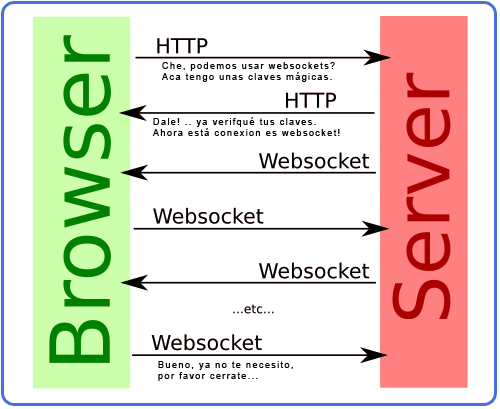

# Clase 3

## Streams

Los streams son colecciones/flujos de datos — algo parecido a los `Arrays` o los `Strings`.
La diferencia es que los datos del stream pueden no estar siempre disponibles, y pueden "contener" más datos que el límite de la memoria.

Una de las propiedades más importantes es el **encadenamiento**, podemos modificar los datos iniciales como si fuésemos encadenando comando de bash:

```bash
$ echo "Hola" | grep "o"
```

**Ejemplos de streams en Node.js**:


### Tipos de streams

- `Readable` (lectura): Es una abstracción de un conjunto de datos de entrada, por ejemplo `fs.createReadStream()`.
- `Writable` (escritura): Es una abstracción del destino en el que será escrito, por ejemplo `fs.createWriteStream()`.
- `Duplex` (lectura y escritura): Por ejemplo un socket TCP.
- `Transform`: Un stream que a parte de leer y escribir va transformando los datos a medida que van llegando, por ejemplo `zlib.createGzip()`.

> Todos los streams son instancias de `EventEmitter`, emiten eventos a medida que leen y escriben datos.
> Sin embargo, podemos consumir y encadenar streams de una manera sencilla utilizando la función `pipe()`.

### La función `pipe()`

```javascript
readableSrc
  .pipe(transformStream1)
  .pipe(transformStream2)
  .pipe(finalWrtitableDest)
```

La función `pipe()` devuelve la salida del stream anterior:

```javascript
a.pipe(b).pipe(c).pipe(d)

// Es equivalente a:
a.pipe(b);
b.pipe(c);
c.pipe(d);

// En Linux, es equivalente a:
$ a | b | c | d
```

### Eventos

Los eventos más importantes de un stream de lectura son:

- `data`: Cada vez que se procesa un trozo del dato.
- `end`: Cuando ya se han emitido la totalidad de los datos.

Los eventos más importantes de un stream de escritura son:
- `drain`: Cuando el stream está disponible para recibir más datos.
- `finish`: Cuando ya se han liberado todos los datos del stream (se vacía).

```javascript
// readable.pipe(writable)

readable.on('data', (chunk) => {
  writable.write(chunk);
});

readable.on('end', () => {
  writable.end();
});
```


### Implementando un stream de lectura y uno de escritura

```js
const { Readable, Writable } = require('stream');

const inStream = new Readable({
  read(size) {
    this.push(String.fromCharCode(this.currentCharCode++));

    if (this.currentCharCode > 90) {
      this.push(null);
    }
  }
});

const outStream = new Writable({
  write(chunk, encoding, callback) {
    console.log(chunk.toString())
    callback();
  }
});

inStream.currentCharCode = 65;

inStream.pipe(outStream);
```

> [Más info](https://medium.freecodecamp.org/node-js-streams-everything-you-need-to-know-c9141306be93)

## WebSockets

WebSocket es una tecnología que proporciona un canal de comunicación bidireccional y full-duplex sobre un único socket TCP. Está diseñada para ser implementada en navegadores y servidores web, pero puede utilizarse por cualquier aplicación cliente/servidor.


- Protocolo de comunicación que se negocia sobre HTTP
- Full-duplex
- Única conexión permanente (siempre conectado)
- Stream de mensajes
- Contenido en tiempo real
- Orientado a "eventos" (mensajes)
- Baja latencia

**Entendiendo los eventos**


**Negociación del protocolo WebSocket**

> Para establecer una conexión WebSocket, el cliente manda una petición de negociación WebSocket, y el servidor manda una respuesta de negociación WebSocket, como se puede ver en el siguiente ejemplo:
> [WebSockets en Wikiwand](https://www.wikiwand.com/es/WebSocket)

- Cliente:

  ```
  GET /demo HTTP/1.1
  Host: example.com
  Connection: Upgrade
  Sec-WebSocket-Key2: 12998 5 Y3 1 .P00
  Sec-WebSocket-Protocol: sample
  Upgrade: WebSocket
  Sec-WebSocket-Key1: 4 @1 46546xW%0l 1 5
  Origin: http://example.com

  ^n:ds[4U
  ```

- Servidor:

  ```
  HTTP/1.1 101 WebSocket Protocol Handshake
  Upgrade: WebSocket
  Connection: Upgrade
  Sec-WebSocket-Origin: http://example.com
  Sec-WebSocket-Location: ws://example.com/demo
  Sec-WebSocket-Protocol: sample

  8jKS'y:G*Co,Wxa-
  ```


> Los 8 bytes con valores numéricos que acompañan a los campos Sec-WebSocket-Key1 y Sec-WebSocket-Key2 son tokens aleatorios que el servidor utilizará para construir un token de 16 bytes al final de la negociación para confirmar que ha leído correctamente la petición de negociación del cliente.

### WS: Nativo

- [Soporte](http://caniuse.com/#search=websocket)
- [Documentación en MDN](https://developer.mozilla.org/en-US/docs/Web/API/WebSocket)

**Abrir la conexión**

```javascript
const myWebSocket = new WebSocket('ws://www.websockets.org');
```

**Gestión de Eventos**

Siempre dispondremos del parametro event.

```javascript
myWebSocket.onopen = function() { console.log("Connection open ..."); };
myWebSocket.onmessage = function(evt) { console.log( "Received Message: ", evt.data); };
myWebSocket.onclose = function() { console.log("Connection closed."); };
```

**Envio de mensajes**

```javascript
myWebSocket.send('Hello WebSockets!');
```

**Cerrar la conexión**

```javascript
myWebSocket.close();
```

### Socket.io


Características:
- Fácil
- Soporte a navegadores obsoletos (Fallback)
- Popular
- Extraordinariamente simple

#### Client side

**Abrir la conexión**:

```html
<script src="/socket.io/socket.io.js"></script>
<script>
  const socket = io();
</script>
```

**Gestión de Eventos**:

```javascript
socket.on('my-event', (data) => {
  console.log('Received Message:', data);
});
```

**Eventos reservados**:
- `connect`

```javascript
socket.on('connect', (socket) => {
  // ...
});
```

- `disconnect`

```javascript
socket.on('disconnect', (socket) => {
  // ...
});
```

- `error`

```javascript
socket.on('error', (error) => {
  // ...
});
```

> [Más en la documentación](https://socket.io/docs/client-api/)

**Envío de mensajes**:

```javascript
socket.emit('my-event', data);
```

**Cerrar la conexión**:

```javascript
socket.disconnect();
socket.close();
// Si quieres reabrir. -> socket.connect();
```

#### Server Side

**Con HTTP directamente:**

```javascript
const server = require('http').createServer();
const io = require('socket.io')(server);

io.on('connection', (socket) =>{
  socket.on('event', (data) =>{
      // ...
  });
  socket.on('disconnect', (socket) =>{
      // ...
  });
});

server.listen(8080);
```

**Con Express:**
```javascript
const app = require('express')();
const server = require('http').createServer(app);
const io = require('socket.io')(server);

io.on('connection', () => {
    // ...
});

server.listen(8080);
```

**Eventos reservados**:

- `connect`

```javascript
io.on('connect', (socket) => {
  // ...
});
```

- `disconnect`

```javascript
io.on('connection', (socket) => {
  socket.on('disconnect', (reason) => {
    // ...
  });
});
```

- `error`

```javascript
io.on('connection', (socket) => {
  socket.on('error', (error) => {
    // ...
  });
});
```

> [Más en la documentación](https://socket.io/docs/server-api/)

**Cheatsheet `emit`**:

```javascript
// sending to sender-client only
socket.emit('message', "this is a test");

// sending to all clients, include sender
io.emit('message', "this is a test");

// sending to all clients except sender
socket.broadcast.emit('message', "this is a test");

// sending to all clients in 'game' room(channel) except sender
socket.broadcast.to('game').emit('message', 'nice game');

// sending to all clients in 'game' room(channel), include sender
io.in('game').emit('message', 'cool game');

// sending to sender client, only if they are in 'game' room(channel)
socket.to('game').emit('message', 'enjoy the game');

// sending to all clients in namespace 'myNamespace', include sender
io.of('myNamespace').emit('message', 'gg');

// sending to individual socketid
socket.broadcast.to(socketid).emit('message', 'for your eyes only');
```

**Compartiendo sesión entre `express` y `socket.io`**:

```javascript
const sessionMiddleware = session({
  store: new RedisStore({}), // XXX redis server config
  secret: 'keyboard cat',
});

// express
app.use(sessionMiddleware);

// socket.io
io.use((socket, next) => {
    sessionMiddleware(socket.request, socket.request.res, next);
});
```

**Recursos**:
- [Socket.io en Github](https://github.com/socketio/socket.io)
- [Socket.io - Express 3/4](http://socket.io/docs/#using-with-express-3/4)

### Nativo vs. Librerías

- [Differences between socket.io and websockets en Stackoverflow](http://stackoverflow.com/a/38558531)
- [WebSocket and Socket.IO by DWD](https://davidwalsh.name/websocket)
- [An Introduction to WebSockets by Matt West](http://blog.teamtreehouse.com/an-introduction-to-websockets)

### Ejemplos

- [IT Pulse](https://github.com/UlisesGascon/twitter-sentiments)
- [Curratelo](https://github.com/UlisesGascon/curratelo)

## Heroku


- [Lenguajes soportados](https://devcenter.heroku.com/categories/language-support)
- [Soporte](https://help.heroku.com/)
- [Precio](https://www.heroku.com/pricing)

**Documentación**:
- [Seguridad](https://devcenter.heroku.com/categories/security)
- [Command Line](https://devcenter.heroku.com/categories/command-line)
- [Arquitectura](https://devcenter.heroku.com/categories/heroku-architecture)
- [Deployment](https://devcenter.heroku.com/categories/deployment)
- [Features](https://devcenter.heroku.com/categories/features)

### Uso

**Instalación del Toolbelt**:

- Universal, mediante `npm`

```bash
# npm
npm install -g heroku-cli

#Linux
wget -O- https://toolbelt.heroku.com/install-ubuntu.sh | sh

# macOS (brew)
brew install heroku/brew/heroku
```

**Login en Heroku**:

```bash
heroku login
```

**Preparando la Aplicación**:

```bash
git clone https://github.com/heroku/node-js-getting-started.git && cd node-js-getting-started
```

**Crear un proyecto**:

```bash
# With a random name
heroku create

# With custom name
heroku create miproyecto
```

**Desplegando nuestro proyecto**:

> Previamente tienes que tener el proyecto gestionado con Git.

```bash
git push heroku master
```

**Escalando nuestro proyecto**:

```bash
# Retrieve the number of "Dynos"
heroku ps

# Scale the web app
heroku ps:scale web=1
```

**Logs del proyecto**:

```bash
heroku logs --tail
```

**Ejecutar el proyecto en local**:

```bash
heroku local web
```

### Addons

- [Documentación General](https://devcenter.heroku.com/categories/add-on-documentation)
- [Lista de Addons](https://elements.heroku.com/addons)
  - [Raygun](https://elements.heroku.com/addons/raygun)
    - Informes de error en tiempo real
    - [Documentación para Node](https://devcenter.heroku.com/articles/raygun#using-with-node)
  - [SendGrid](https://elements.heroku.com/addons/sendgrid)
    - Sistema de envio de emails con muchos extras
    - [Documentación para Node](https://devcenter.heroku.com/articles/sendgrid#node-js)
  - [Easy SMS](https://elements.heroku.com/addons/easysms)
    - Envio/Recepción de SMS mundial
    - [Documentación](https://devcenter.heroku.com/articles/easysms)
  - [mLab MongoDB](https://elements.heroku.com/addons/mongolab)
    - MongoDB as a Service
    - [Documentación para Node](https://devcenter.heroku.com/articles/mongolab)
  - [GrapheneDB](https://elements.heroku.com/addons/graphenedb)
    - Neo4j Graph as a Service
    - [Documentación para Node](https://devcenter.heroku.com/articles/graphenedb#using-with-node-js-and-node-neo4j)
  - [ClearDB MySQL](https://elements.heroku.com/addons/cleardb)
    - MySQL
    - [Documentación](https://devcenter.heroku.com/articles/cleardb)
  - [Graph Story](https://elements.heroku.com/addons/graphstory)
    - Enterprise Neo4j Graph Databases as a Service
    - [Documentación](https://devcenter.heroku.com/articles/graphstory)
  - [Heroku Scheduler](https://elements.heroku.com/addons/scheduler)
    - Programador de tareas
    - [Documentación](https://devcenter.heroku.com/articles/scheduler#dyno-hour-costs)
  - [Process Scheduler](https://elements.heroku.com/addons/process-scheduler)
    - Programa el escalamiento de tus *process types* y *dynos* por horas
    - [Documentación](https://devcenter.heroku.com/articles/process-scheduler)
  - [DocRaptor](https://elements.heroku.com/addons/docraptor)
    - Conversor de HTML a PDF. Simple y robusto
    - [Documentación](https://devcenter.heroku.com/articles/docraptor)
  - [Tinfoil Security](https://elements.heroku.com/addons/tinfoilsecurity)
    - Escaner de seguridad
    - [Documentación](https://devcenter.heroku.com/articles/tinfoilsecurity)
  - [Auth0](https://elements.heroku.com/addons/auth0)
    - Gestión de credenciales
    - [Documentación del Addon](https://devcenter.heroku.com/articles/auth0)
    - [Documentación para Node](https://auth0.com/docs/quickstart/webapp/nodejs)
  - [OAuth.io](https://elements.heroku.com/addons/oauthio)
    - Gestión de credenciales. Más de 100 provedores
    - [Documentación](https://devcenter.heroku.com/articles/oauthio)
  - [CloudAMQP](https://elements.heroku.com/addons/cloudamqp)
    - RabbitMQ as a Service
    - [Documentación para Node](https://devcenter.heroku.com/articles/cloudamqp#use-with-node-js)
  - [Keen IO](https://elements.heroku.com/addons/keen)
    - Analíticas para desarrolladores
    - [Documentación para Node](https://devcenter.heroku.com/articles/keen#using-with-node)
  - [Bonsai Elasticsearch](https://elements.heroku.com/addons/bonsai)
    - Elasticsearch
    - [Documentación](https://devcenter.heroku.com/articles/bonsai)


### Otros paquetes

**[ndb](https://www.npmjs.com/package/ndb)**:
- Instalación global.
- Utilizar `debugger;` para lanzar las herrameintas de depuración del navegador.
- Depuración mediante Chromium.

```bash
ndb server.js
```

**[nodemon](https://www.npmjs.com/package/nodemon)**:
Relanza la aplicación por cada cambio que realicemos en diferentes ficheros.

```bash
nodemon server.js
```

**[forever](https://www.npmjs.com/package/forever)**:

Relanza la aplicación cuando deja de funcionar

```bash
forever start/stop server.js
```
**[pm2](https://www.npmjs.com/package/pm2)**:
Monitorización activa de la aplicación

```bash
pm2 start/stop server.js
```

> [Awesome Node.js](https://github.com/sindresorhus/awesome-nodejs/)


## Ejercicios

**1 -** Partiendo del repositorio [simple-chat#template](https://github.com/josex2r/simple-chat/tree/template) implementa toda la parte de servidor utilizando la librería `socket.io`.

- **[Solución](https://github.com/josex2r/simple-chat)**
